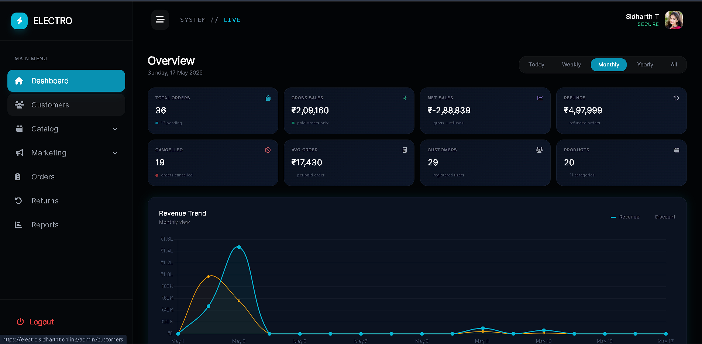
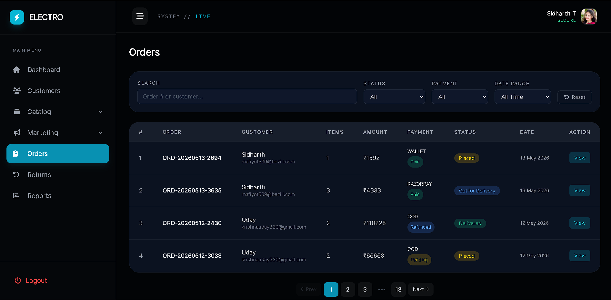

# ⚡ Electro — Full-Stack E-Commerce Platform

A production-ready e-commerce web application built for electronics retail. Electro covers the complete shopping lifecycle — from product discovery and cart management to payment processing, order tracking, returns, and admin operations.

---

## 🚀 Live Demo

🌐 **[electro.sidhartht.online](https://electro.sidhartht.online)**

---

## 📸 Screenshots

### 🏠 Homepage


### 📊 Admin Dashboard


### 📦 Order Management


---

## 🧰 Tech Stack

| Layer | Technology |
|---|---|
| **Runtime** | Node.js (ESM) |
| **Framework** | Express.js v5 |
| **Database** | MongoDB + Mongoose |
| **Cache** | Redis |
| **View Engine** | EJS |
| **Styling** | Tailwind CSS |
| **Payments** | Razorpay |
| **File Storage** | Cloudinary + Multer |
| **Auth** | Passport.js (Google OAuth 2.0), Argon2, JWT |
| **Real-time** | Socket.io |
| **Email** | Nodemailer |
| **SMS / OTP** | Twilio |
| **PDF** | PDFKit |
| **Excel Export** | ExcelJS |
| **Validation** | Joi |
| **Security** | Helmet, express-rate-limit |
| **Scheduler** | node-cron |
| **Linting** | ESLint + Husky + lint-staged |

---

## ✨ Features

### 🛍️ User Side

**Authentication**
- Email + password signup with OTP verification
- Google OAuth 2.0 login
- Forgot password via email OTP
- Argon2 password hashing

**Product Browsing**
- Shop page with real-time AJAX filtering (category, brand, price range, search, sort)
- Product detail page with multi-variant selection (color, RAM, storage, size, etc.)
- Wishlist — add/remove with live count update
- Real-time stock badges via Socket.io (In Stock / Few Left / Sold Out)
- Redis-cached product listings for fast page loads

**Cart**
- Add to cart with quantity controls (max 3 per variant, max 5 unique products)
- Real-time stock validation on quantity change
- Coupon application with live discount preview
- Pre-checkout stock validation before proceeding

**Checkout & Payments**
- Address management (add, edit, set default)
- Three payment methods: COD, Razorpay (online), Wallet
- Buy Now — skip cart, order a single item directly
- Razorpay: 15-minute payment window with stock reservation
- Payment retry within the window with full re-validation
- Wallet top-up via Razorpay

**Orders**
- Order listing with search and pagination
- Order detail page with item-level status tracking
- Cancel full order or individual items
- Proportional refund on partial cancellation
- Return request with reason, comments, and item condition

**Wallet**
- Balance display with full transaction history
- Credits from: refunds, referrals, top-ups
- Debits from: order payments

**Referral System**
- Unique referral code per user
- Wallet credit on successful referral

**Invoice**
- Download PDF invoice per order

---

### 🔧 Admin Side

**Dashboard**
- Revenue, orders, customers, and product stats
- Sales chart (daily/weekly/monthly)
- Recent orders and low-stock alerts

**Catalog Management**
- Categories — create, edit, list/unlist, soft delete
- Brands — create, edit, list/unlist, logo upload
- Products — create with multiple variants, images via Cloudinary, list/unlist

**Offer & Coupon Engine**
- Product-level, category-level, and brand-level offers
- Percentage or fixed discount with max discount cap per variant
- Coupons with expiry, usage limits, per-user limits, and min order amount

**Order Management**
- Full order list with search, status filter, payment filter, date range filter
- Order detail with item-level status updates for multi-item orders
- Smart order cancellation with automatic refund routing (wallet / manual / on-hold)
- COD, Razorpay, and Wallet payment method awareness

**Return Management**
- Dedicated Returns tab — separate from Orders
- Status pipeline: Requested → Approved → Pickup Scheduled → Returned
- Approve or reject with reason
- Schedule pickup with date
- Mark as returned — triggers automatic stock action and wallet refund
- Smart stock action: restock / damaged inventory / pending inspection based on item condition

**Customer Management**
- Customer list with search
- View profile, order history, block/unblock

**Reports**
- Sales report with date range filter
- Export to PDF and Excel

---

## 🏗️ Project Structure

```
src/
├── config/          # DB, Cloudinary, Razorpay, Passport, Mailer
├── constant/        # Status codes, messages, auth constants
├── controllers/
│   ├── admin/       # Admin-side controllers
│   ├── product/     # Product, payment, offer, brand, category controllers
│   └── user/        # User auth, orders, wallet, address controllers
├── jobs/            # node-cron jobs (payment expiry)
├── middlewares/     # Auth, rate limiter, image validation, error handler
├── models/          # Mongoose schemas
├── routes/
│   ├── admin/       # Admin routes
│   ├── product/     # Product/payment routes
│   └── user/        # User routes
├── services/
│   ├── admin/       # Admin business logic
│   ├── payment/     # Razorpay create, verify, success, retry
│   ├── product/     # Product listing, coupon, refund, offer services
│   └── user/        # Auth, order, cart, wallet, referral services
├── utils/           # Pricing engine, offer calculator, Redis cache, AppError
├── validations/     # Joi schemas for request validation
├── views/
│   ├── admin/       # Admin EJS templates
│   ├── user/        # User-facing EJS templates
│   └── partials/    # Shared header, footer, head
├── app.js           # Express app setup
└── index.js         # Server entry point
```

---

## ⚙️ Environment Variables

Create a `.env` file in the root with the following keys:

```env
# Server
PORT=3000
NODE_ENV=development

# MongoDB
MONGO_URI=your_mongodb_connection_string

# Redis
REDIS_URL=your_redis_url

# Session / JWT
JWT_SECRET=your_jwt_secret
SESSION_SECRET=your_session_secret

# Google OAuth
GOOGLE_CLIENT_ID=your_google_client_id
GOOGLE_CLIENT_SECRET=your_google_client_secret
GOOGLE_CALLBACK_URL=http://localhost:3000/auth/google/callback

# Razorpay
RAZORPAY_KEY=your_razorpay_key_id
RAZORPAY_SECRET=your_razorpay_key_secret

# Cloudinary
CLOUDINARY_CLOUD_NAME=your_cloud_name
CLOUDINARY_API_KEY=your_api_key
CLOUDINARY_API_SECRET=your_api_secret

# Nodemailer
MAIL_USER=your_email@gmail.com
MAIL_PASS=your_app_password

# Twilio (OTP)
TWILIO_ACCOUNT_SID=your_account_sid
TWILIO_AUTH_TOKEN=your_auth_token
TWILIO_PHONE_NUMBER=your_twilio_number

# Admin
ADMIN_EMAIL=admin@example.com
ADMIN_PASSWORD=your_admin_password
```

---

## 🛠️ Getting Started

### Prerequisites

- Node.js >= 18
- MongoDB (local or Atlas)
- Redis (local or cloud)
- Razorpay account
- Cloudinary account
- Google Cloud Console project (for OAuth)

### Installation

```bash
# Clone the repository
git clone https://github.com/your-username/electro.git
cd electro

# Install dependencies
npm install

# Build Tailwind CSS
npm run build:css

# Start development server
npm run dev
```

The server starts at `http://localhost:3000`

Admin panel: `http://localhost:3000/admin`

---

## 🔑 Key Technical Details

### Stock Reservation System
Razorpay orders use a two-phase stock model. At order creation, `variants.reserved` is incremented (stock is held but not decremented). On payment success, both `stock` and `reserved` are decremented atomically. If payment fails, reserved stays intact for the retry window. A cron job runs every minute to release reservations on expired orders.

### Proportional Refund on Partial Cancellation
When one item in a multi-item order is cancelled, the coupon discount is split proportionally using the original immutable `originalCouponDiscount` field — not the already-reduced value — preventing compounding errors across multiple partial cancellations.

### Return Stock Logic
When a return is completed, the system auto-determines the stock action:
- `defective` / `missing_parts` / `damaged` reason → `damaged_inventory` (no restock)
- `wrong_item` reason → `pending_inspection`
- `sealed_new` / `opened_good` condition → `restock`

### Redis Caching
Product listing results are cached with a key that includes category, brand, page, limit, sort, and price range. Cache is bypassed for search queries. Cache key is versioned so stale results are never served after schema changes.

### Real-time Stock
Every stock mutation (order placement, cancellation, return) emits a `stockUpdated` Socket.io event with the new available stock. The cart page and shop page update badges live without a page reload.

---

## 📦 Scripts

```bash
npm run dev              # Start dev server with nodemon
npm run build:css        # Build Tailwind CSS for both user and admin
npm run lint             # Run ESLint
npm run seed:orders      # Seed dummy orders (500 default)
npm run seed:orders:clean  # Seed 1000 orders, clean existing first
```

---

## 📄 License

ISC

---

## 👤 Author

**Sidharth T**
🌐 [sidhartht.online](https://sidhartht.online)
🐙 [github.com/SidharthT-TechExpert/Electro.V2](https://github.com/SidharthT-TechExpert/Electro.V2)
